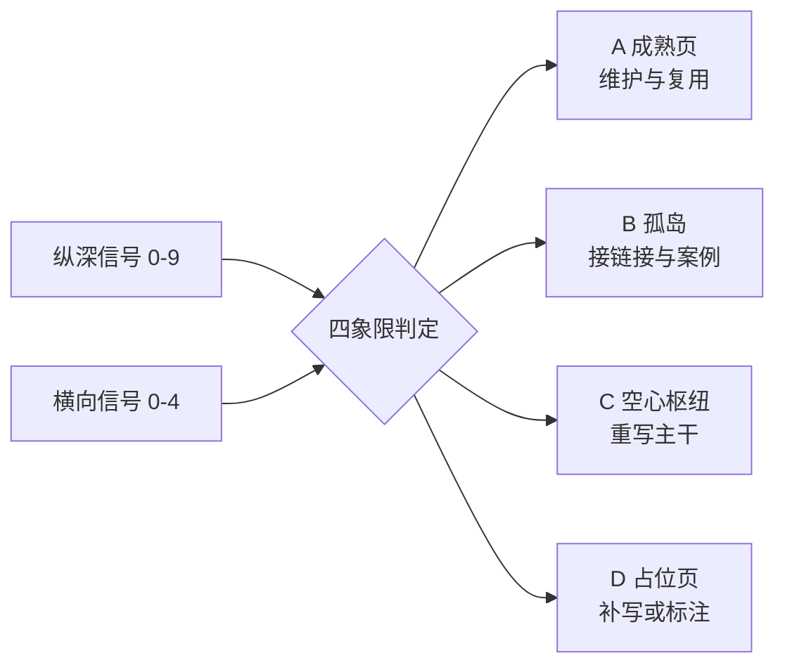

# 知识完善度怎么判断——四象限与九个信号

"这篇写完了吗"没法直接回答，因为"写完"混着两件独立的事：这一页自己把机制讲透了没有，以及它在知识网络里是不是活的。两件事可以单独成立，也可以同时不成立。

篇幅长、小标题齐全的页面照样可能不完善。库里 [[工程知识/后端系统：在并发、失败与变化中维持服务/服务设计/认证授权决定请求能看什么和做什么]] 有 4582 字符，小标题从认证、三种授权模型一路排到撤权与验证，纵向看相当完整。它在横向上的得分是零——154 篇概念页里只有 1 篇链回了缺陷案例，它不在其中。同期库里躺着 40 个真实故障案例（僵尸监听器、游标跳过、回收后复用、先检查后使用），没有一个回流到它。

按篇幅它算写得好。按完善度它落在孤岛象限。

还有一种更隐蔽的：一张页被七八张页引用，图谱上看着是枢纽，点进去只有定义、分类和三条最佳实践。它损害的是读者对整张网络的信任——顺着链接进来的人默认这里该有 fundamentals。

这两种是性质不同的缺陷，补法也不同。所以判断必须拆成两个维度。

## 为什么篇幅说明不了问题

"写得挺全"通常指三件事：篇幅长、小标题多、有代码块有表格。这三条都能在不回答任何实质问题的情况下凑齐。

| 常见的"全" | 实际能证明什么 |
| --- | --- |
| 篇幅长 | 作者肯写，证明不了机制讲透了 |
| 小标题多 | 结构清晰，证明不了每节有内容 |
| 有代码块 | 有示例，证明不了示例能跑、能复现 |
| 有表格 | 做了对比，证明不了对比维度是关键取舍 |

**完善度是网络属性，不是单篇属性。** 一篇页写得再长，没人能顺着路径走到它，等于这份投入没有产生网络价值；一篇页被大量引用，里面装的却是断言，它会把不可信传导给所有邻居。

## 维度一：纵深完备度的九个信号

[[知识库管理/方法/一篇知识怎么写]] 已经规定了一页必须回答的九个问题。判断完善度时要把它们从"要回答什么"转成"怎么确认回答了没有"——每个问题对应一个能在文本里观测到的产物。

| 信号 | 可观测产物 | 怎么检 | 缺失时的样子 |
| --- | --- | --- | --- |
| problem | "不解决会付出什么代价"的具体后果 | 背景段有无后果陈述 | 开头只有"X 很重要、很常用" |
| essence | 删掉产品名仍成立的机制句 | 人工：替换专有名词再读 | 通篇产品名与功能列表 |
| mechanism | 输入→状态→转换→输出→反馈 的因果链 | 人工：能否画出状态变化 | 只有定义、分类、特性表 |
| benefit | **带测试条件的**数字 | 数字附近有无版本/规模/硬件 | "更快""提升明显"无数字 |
| example | 可复现的最小例子 | 代码块含输入输出 | 只有伪代码，或没有例子 |
| boundary | 反例或不适用清单 | 有无"不该用/会失效"段 | 只讲适用，不谈边界 |
| verification | 断言、测试、复现步骤 | 有无 assert / 复现 / 观测命令 | 只有结论，无法反驳 |
| relations | 关系行 + 相邻概念辨析 | 文末关系行、正文比较段 | 孤立，无入链无出链 |
| freshness | frontmatter 日期与 change_rate | updated / review_after 字段 | 日期过期或字段缺失 |

**九条里 `essence`、`mechanism`、`boundary` 决定页面的大部分价值**，这三条无法靠堆内容蒙混。剩下六条是支撑与验证。

检测分两类：六条可脚本扫（代码块、数字、日期、关系行、关键词），三条必须人工读（essence 的抽象度、mechanism 的因果、boundary 的质量）。脚本负责出可疑名单，人工确认，脚本判断不了散文质量。

## 维度二：横向完备度的四个信号

| 信号 | 怎么数 | 合格线 |
| --- | --- | --- |
| 入链 | 全库指向本页的链接出现次数 | ≥1 条真实入链（自引不算） |
| 出链 | 本页指向他页的链接数量 | ≥2 条，至少 1 条跨子域 |
| 证据回流 | 是否链到至少一个缺陷案例 | ≥1 条（该主题有案例时） |
| 概念辨析 | 与相邻概念的区分段 | ≥1 处"与 X 的区别/何时不用" |

入链与出链解决"能不能找到"，证据回流解决"主张有没有真实故障支撑"，概念辨析解决"和邻居的边界在哪"。

**证据回流是全库最弱的一项。** 154 篇概念页里只有 1 篇做到。库里同时有 40 个真实案例沉淀着可复用机制。这些机制没有回流到任何概念页，案例库与概念库实际是两套互不知道的知识——这才是"明明有了文章却漏了知识"的结构性原因。

## 四象限

纵横两个维度交叉，得到四种状态：

|  | **横向通**（连接良好） | **横向断**（连接稀疏） |
| --- | --- | --- |
| **纵深足**（机制讲透） | **A 成熟页** | **B 孤岛** |
| **纵深缺**（只有断言） | **C 空心枢纽** | **D 占位页** |

### A 成熟页

九个信号齐全，有真实入链与出链，主张能回溯到案例或 P0/P1 来源。它可以充当其他页的前置，改它要小心——下游依赖它。处置是定期复核 `review_after`，以及当新案例出现时回流进来。

### B 孤岛

内容写透了，网络里没人引用它，它也没引用几个邻居，案例回流为零。

它的损失是**已有的投入没有产生网络价值**。这是最划算的一类补强对象：内容不用重写，只需接上。典型补法是补关系行、在域首页与相邻页挂入链、把同主题的缺陷案例链进来。

### C 空心枢纽

入链多，自身只有定义、分类、断言。

它比孤岛危险，因为它在图谱上占着重要位置，读者会顺着多条链接进来，然后发现里面没有机制。**它消耗的是整张网络的信任度**，一个空心枢纽会让所有指向它的页面显得可疑。补它要重写主干，成本最高，优先级却也最高。

### D 占位页

内容短，连接也少。数量最大——全库 154 篇里 57 篇正文不足 1500 字符。

它本身不是错误，"这里有个坑位"是合理状态。问题在于读者无法区分占位页与成熟页，会误以为点进去能看到机制。处置要么补写成 A，要么在 frontmatter 明确标 `status: draft` 让读者有预期。

## 两个必须手工做的判断动作

脚本能扫出六条信号，剩下三条靠读。读的时候做两个动作：

**动作一：删掉产品名再读一遍。** 把专有名词全部替换成 `X`，剩下的如果全是口号，机制就没抽出来。这一条直接验 `essence`。

**动作二：追一次真实故障。** 问"这个机制失效时现象是什么，怎么观测到"。答不上来说明 `mechanism` 或 `boundary` 有洞，同时顺带验了 `verification`。

两个动作各花一分钟，能挡住大部分"看着挺全"的页面。

## 补强顺序

**先补 C，再补 B，最后处理 D。**

排序依据是影响力而非难度。C 在图谱上位置重要，修一张能改善所有指向它的页面的可信度；B 内容已有，只需接链接，单位投入收益最高；D 数量最多，逐张补写会耗尽预算，应当只补那些入链多或主题核心的，其余明确标为待补。

这个顺序与"从最简单的开始"相反。完善度是网络属性，枢纽的缺陷会放大到邻居，所以优先修枢纽。

## 相关

- [[知识库管理/方法/一篇知识怎么写]] —— 一页必须回答什么（本页的上游规范）
- [[知识库管理/方法/知识缺口怎么补——图谱关系槽与补强工作流]] —— 补齐的具体操作
- [[知识库管理/归档/知识质量标准]] —— 合格与不合格判定
