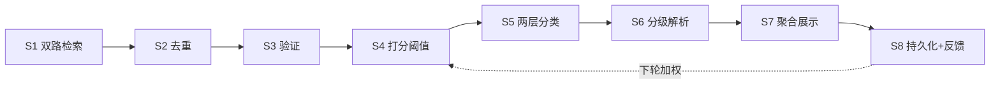

# 论文怎么追踪、怎么解析

这篇回答两件事：**新论文怎么筛出来**，以及**筛出来之后怎么解析成能用的知识**。

和 [[知识库管理/方法/知识从哪来怎么更新]] 的分工：那篇讲**人**怎么读、筛、去重、
验证一篇来源；这篇讲**一条能自动跑的追踪管道**怎么设计，以及机器产出的东西要到什么
标准才算能进知识库。

论文和博客、文档不同：它有明确的发布时间、可校验的编号、结构化的元数据，所以可以
被机器稳定追踪。代价是量极大，而且**绝大多数不值得读** —— 管道的价值在于把
"哪些值得看"这件事判断出来，不是把搜索结果倒出来。

---

## 一、五条铁律

违反任何一条，系统就会退化成 RSS 转发。这五条是判断层，管道只是实现。

| # | 铁律 | 含义 |
|---|---|---|
| 1 | 宁缺毋滥 | 不达标就不交付；不凑数、不擅自扩大时间窗 |
| 2 | 零幻觉 | 编号、链接、数字必须来自真实请求，宁漏勿编 |
| 3 | 分级投入 | 深度按价值分配，不是每篇都深读 |
| 4 | 主流程瘦 | 全文在隔离子任务里读，只回传结构化结果 |
| 5 | 失败隔离 | 单条失败不阻断整批 |

**第 2 条最容易被违反**，因为编造看起来很像真的。一个不存在的 arXiv 编号、
一个凭印象写的指标数字，读者无法分辨，而它会一路进到知识页里。所以凡是要写进
交付物的编号，必须通过真实请求校验（见第三节 S3）。

---

## 二、配置先行

跳过这一节，后面所有"相关性"判断都失去锚点。

三个身份字段，注入到打分的提示里：

```
role              以什么身份在看这些内容
research_focus    关注的具体方向（用于判断相关性）
evaluation_angle  评判价值的角度（用于打分）
```

两组源配置：

```
权威源白名单   机构 / 作者 / 会议 / 期刊，每项含 name + aliases + 校验域
主题关键词组   概念词（1-3 个定义领域）+ 方法词 + 任务词
```

关键词组的构造模板：

```
概念层：{concept1} OR {concept2}
方法层：{method1} OR {method2}
任务层：{task1} AND ({concept1} OR {concept2})
```

先用默认值跑通，跑满两周再用真实反馈回看阈值和关键词。**不要在配置上过度前置设计** ——
两周真实反馈比空想的精细配置有价值。

---

## 三、管道



### S1 双路检索

两路互斥不重叠，避免同一内容重复计入：

```python
if 权威源命中 > 0:
    候选, 路径标记 = 权威源命中, "authority"
else:
    候选, 路径标记 = 主题源TopN(), "topic_pick"   # 自动兜底，非 opt-in
```

主题源路径：宽检索取大候选集（约 100）→ 时间窗过滤 → 语义打分 → 取 Top N 且过阈值。

时间窗：增量 24 小时（周一 72 小时，覆盖周末）；兜底回看 7 天。

**检索要用字段限定，不要全文匹配** —— 全文匹配会命中"正文里提到某机构"的杂质。
别名多个用 `OR` 拼接，含连字符的别名加引号，每个权威源只跑一次组合查询。

arXiv 为例：

```
search_query=(au:{alias1} OR au:{alias2}) AND (abs:{kw1} OR abs:{kw2}) AND (cat:cs.xx)
sortBy=submittedDate&sortOrder=descending&max_results=50
```

### S2 去重

三重，按可靠性排序：

1. **编号归一化** —— 剥掉版本后缀（`2602.22732v3` → `2602.22732`），按裸编号判重。最可靠。
2. **已处理集合** —— 历史编号索引，入库前扫描。
3. **标题相似度** —— 识别"会议版 vs 预印版"这类编号不同但实质相同的情况，保留信息更完整的那版。

### S3 验证：四道防线

四道关都必须真实请求，不允许推断：

```
① 元数据层  字段限定检索命中（非全文匹配）
② 标识符层  对每个编号发起请求，200 才通过；否则整条丢弃，记录 [幻觉拒收: {id}]
③ 语义层    二次确认，要求给出可指认的证据之一
            （出现具体量化指标，或场景关键词与 research_focus 直接对应），否则 false
④ 内容层    实际拉取正文并解析成功；失败则降级为 L1，不进 L2
```

语义层的关键：**要求"有证据"而非"感觉相关"**，把判断落在可指认的事实上。

低成本附加校验：编号内嵌的时间戳不得晚于当前时间（arXiv 编号前 4 位 ≤ 当前年月）。

### S4 打分与阈值

以 `role` 身份、从 `evaluation_angle` 角度打 0-10 分，输出严格结构化的结果。

```
保留 score >= 阈值
达标数 < 目标数 → 按实际达标数交付，绝不降标准凑数
达标数 == 0     → 明确报空，询问是否扩窗，不擅自扩
```

### S5 两层分类

扁平标签在内容变多后必然失效，所以分两层：

- **领域层** —— 所属子领域，对应存储目录
- **角色层** —— 在领域中的作用定位：`method` 新方法 / `theory` 理论 /
  `application` 落地实践 / `evaluation` 评测基准

分类在解析前完成，因为它决定深度分配和归档位置。

### S6 分级解析

| 级别 | 内容 | 适用 | 成本 |
|---|---|---|---|
| L0 | 元数据卡片（编号/标题/作者/来源/日期/链接） | 全部候选 | 极低 |
| L1 | 结构化摘要 | 全部入选 | 低 |
| L2 | 八模块深度解读 | 每批 1-3 篇高价值 | 高 |
| L3 | 复现指南（环境/代码骨架/步骤/预期指标） | 极少数要落地 | 很高 |

**L1 字段**（字数硬约束，是日报的主力）：

```
一句话摘要    ≤50 字大白话
解决的问题    ≤80 字
核心方法      ≤120 字
关键结果      必须带数字（正则 \d 可校验）
与本库关联    针对这本库关注的方向定制
链接          已过验证
```

**L2 八模块**（缺任一模块即质量失败）：

```
1 背景与问题      动机（讲清先前方法的局限）+ 核心问题（写成疑问句）
                  + 直觉洞见（类比）+ 核心矛盾（两个不能同时要的东西）
2 核心方法        逐组件编号描述，点明区别于先前工作的关键设计决策
3 技术细节        至少一个公式或算法 + 关键超参及其作用
                  + 损失函数 / 训练策略（单独交代，它决定这个方法能不能跑起来）
4 实验与结果      数据集与指标（标注 ↑/↓ 方向）+ 对比表（本文结果加粗）+ 消融 + 关键发现
5 亮点与洞察      为什么这样设计而不是那样；设计上巧妙的那一处
6 局限性          至少 2 条，编号列出
7 复现指南        环境依赖 + 代码骨架 + 编号步骤（含具体超参与预期指标）
8 相关工作与启发  与哪些已有工作呼应；对本库哪些知识有影响
```

"核心问题写成疑问句""指标标注方向""局限至少 2 条"，都是把主观写作变成**可核查约束**的手段。

**第 5、8 模块的来源与取舍**：这两节参考了 [PaperNotes](https://papernotes.org/) 的解析结构
（它的骨架是「一句话总结 / 研究背景与动机 / 方法详解 / 实验关键数据 / 亮点与洞察 / 局限性 /
相关工作与启发 / 评分 / 相关论文」）。对照下来：

| 它有的 | 本库的处理 |
|---|---|
| 亮点与洞察 | **采纳**。做完一项工作最该带走的就是"为什么这样设计"，原六模块把这块漏了 |
| 相关工作与启发 | **采纳**。论文的价值一半在它所在的脉络里，孤立地读容易高估 |
| 核心矛盾 | **采纳**，并入第 1 模块。比"动机"更锋利：它逼你说清冲突的两端 |
| 损失函数 / 训练策略 | **采纳**，并入第 3 模块。很多方法复现不了就卡在这里 |
| 评分 | **不采纳**。那是它社区语境的产物；本库是个人知识库，评分没有消费者 |
| 标签云 | **不采纳**。本库已有领域 / 主题两级分类，再叠一层标签是重复 |
| 会议分类 | **不采纳**。本库按知识对象组织，不按会议或年份 |

**公式怎么写在 markdown 里**：站内已 vendored KaTeX，行内用 `$...$`，块级用 `$$...$$` 独占多行。
写正文时直接写 LaTeX 即可，页面会渲染。这是唯一一处不遵循"纯文本可读"的地方 ——
没有它第 3 模块就只能写成一串反斜杠。

**引入外部评价**：除内容自述外，主动抓取公开评审（审稿评分、优缺点、元评审、作者回应）。
一条特别有效 —— **作者回应评审时往往说出正文没讲透的方法本质**，这类洞见应合并进核心部分；
同理，评审人的质疑往往就是最好的"局限性"素材。

### S7 聚合展示

见第五节。

### S8 持久化与反馈

每轮写日志：候选列表、各级结果、交付结果、失败记录。反馈文件每行一条：

```json
{"ts":"ISO8601","id":"...","source":"...","signal":"like|dismiss|important","reason":"可选"}
```

加权**刻意不对称** —— "明确不想要"的信息量高于"还不错"：

```
like      → 同来源 +0.1
dismiss   → 同来源 -0.15
important → 同关键词 +0.2
```

---

## 四、存储

```
state/
  watermark.json      上次成功运行时间（唯一权威的增量基准）
  seen_ids.jsonl      已处理编号（去重的第二重）
  feedback.jsonl      反馈信号
logs/YYYY-MM-DD.md    每轮运行记录
output/               交付物
kb/
  {领域层}/{角色层}/{id}_{short_title}.md
  INDEX.md            索引，供去重第三重扫描
```

文件命名统一 `{id}_{short_title}.md`，使去重可以直接用文件系统扫描完成。
**知识库是长期资产，版本化管理；日报是流，阅后即焚。**

---

## 五、展示

### 日报（流）

```markdown
📅 {YYYY-MM-DD}（周X）· {路径标记}
> 来源 {源列表} | 窗口 {时间窗} | 收录 {N} 条 | 分类分布 {...}

## 【{来源/机构}】{标题}
- 一句话摘要：...
- 解决的问题：...
- 核心方法：...
- 关键结果：...          ← 必须含数字
- 与本库关联：...
- 链接：https://...
```

`topic_pick` 路径额外加 `来源` 和 `推荐理由` 两个字段。末尾附审计段（验证证据、打分）。

### 趋势报告（聚合 · 周/月）

重点**不是罗列篇目**，而是跨内容的模式：热点方向迁移、方法范式更替、高产团队、
指标水位变化、同题不同解的对照。**只做罗列的日报等于 RSS 转发，没有增量价值。**

### 排版纪律

```
数学符号用 Unicode（∇ ∈ ≤ ≥ α β σ ∑），不用 LaTeX $...$
链接纯文本直书，不用 Markdown 链接语法
数字指标标注方向（↑ 越高越好 / ↓ 越低越好）
本文提出的方法结果加粗，缺失值统一填 —
中文叙述 + 英文术语、模型名、数据集名保留原文
```

---

## 六、定时化的坑在状态，不在逻辑

- **水位线** —— 持久化 `last_successful_run_at`，窗口取 `[last_run - overlap, now]`，
  overlap 约 2 小时覆盖源站索引延迟。**只在成功运行后推进**，失败不推进。
- **幂等** —— 同窗口重跑结果一致，靠 S2 去重保证，所以重试是安全的。
- **追赶** —— 连续失败后不跳窗，用未推进的水位线重跑累积窗口，保证不丢。
- **冷启动** —— 首轮无水位线，用兜底回看窗口（7 天）并标记 `cold_start`；
  **首轮只出 L1 不做 L2**，避免首轮爆炸。
- **失败隔离** —— 单条失败重试 1 次，仍失败就填占位符（保留编号与链接，标记"解析失败"），
  不阻断同批，交付时说明哪些失败。
- **并发与预算** —— 并行解析上限 5，超出分批；设单次时间预算与单条成本上限，
  超预算则降级（L2 → L1）而不是中断。

---

## 七、交付前的质量 gate

任一条不通过即拒绝交付：

```
1  首行符合约定的日期标题格式
2  路径互斥：authority 与 topic_pick 的措辞不混用
3  必填字段全覆盖（authority 六字段，topic_pick 八字段）
4  关键结果含数字（正则 \d）
5  链接以约定前缀开头且已通过 S3 第②关
6  编号内嵌时间戳不晚于当前时间
7  元数据与源站一致（作者/来源/日期）
8  表格结构完整，无空单元格（用 — 占位）
9  无重复条目（按归一化编号校验）
10 分类归属已填且落在既有分类体系内
```

---

## 八、开箱默认值

首次搭建直接用，不必纠结精细配置：

| 项 | 默认值 |
|---|---|
| 单次处理量 | 3-8 条 |
| 增量窗口 / 兜底回看 | 24h（周一 72h）/ 7 天 |
| 打分阈值 | ≥ 5，不足不凑数 |
| 主题源 Top N | 3 |
| 并行解析上限 | 5 |
| 深度解读（L2）/ 批 | 1-3 条 |
| 失败重试 | 1 次后填占位符 |
| 水位线 overlap | 2h |
| 反馈加权 | +0.1 / -0.15 / +0.2 |
