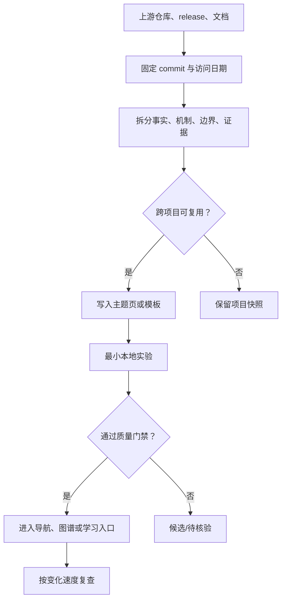

# 项目方法反哺机制

开源项目是方法和证据的来源，不是知识库的主分类。项目会快速变化，真正值得长期保留的是它解决问题的机制、输出契约、边界和验证方式；版本号、页面样式和短期功能只作为可复核的当前状态。

## 反哺对象的四种去向

| 观察到的内容 | 去向 | 保留方式 |
| --- | --- | --- |
| 跨项目仍成立的原则 | 主题知识 | 合并到对应 AI、后端、数据、性能或质量页面 |
| 当前版本的能力或 API | 来源与动态页 | 记录 commit/release、访问日期、兼容范围和复核日 |
| 可复用的教学/工程结构 | 模板或工作台能力 | 先做最小样例，再决定是否进入默认流程 |
| 只对该项目成立的实现细节 | 项目快照 | 保留源码和 README，不复制成长期知识 |

“项目有这个按钮”不是知识主张；“这个按钮如何把一个学习目标转成可观察的行为证据”才可能成为跨项目方法。

## 一次上游审查的流水线



审查时至少留下：仓库 URL、commit 或 release、访问日期、变更摘要、引用文件、可复用判断、实验结果、许可证和下一次复核日期。没有这些信息的“我觉得这个项目很好”不进入核心页面。

## 当前四个项目的反哺结论

| 项目 | 值得吸收的稳定方法 | 快速变化的内容 | 本库落点 |
| --- | --- | --- | --- |
| Archify | 类型化中间表示、确定性验证、证据节点、last-good 交付、多种图语义 | renderer、视觉预设、CLI 参数和版本 | 图谱视图、知识点输出契约、证据门禁 |
| OpenMAIC | 按学习目标选择讲解/测验/模拟/项目，Skill 与运行时分层，局部编辑 | provider、DSL、媒体能力和课程 UI | 学习活动页、输出类型表、课程入口 |
| DeepTutor | 能力路由、研究/可视化/记忆分层、来源与索引分离、学习路径 | RAG 引擎、模型支持、插件和配置 | RAG/学习主题、复习机制、工具入口 |
| Matt Skills | 一手来源研究、复用优先、反馈回路、测试和审查、短期研究与长期决策分开 | Skill 名称、路由规则、社区实现 | 来源注册、研究模板、质量门禁 |

这些结论已经分别进入 [[知识库管理/维护/知识点写作与教学输出契约]]、[[工程知识/AI系统/质量与运营/学习活动需要结果、轨迹与迁移证据]] 和项目来源页。项目名称仍用于回溯，不用于建立“项目知识”目录。

## 更新触发与复查窗口

| 信号 | 处理动作 | 默认时限 |
| --- | --- | --- |
| release、破坏性变更、安全公告 | 立即核对受影响主题和入口，保留旧结论的替代关系 | 24 小时内 |
| 新 capability、Skill 或输出类型 | 判断它是新机制还是旧机制的新实现；先做最小样例 | 7 天内 |
| README/文档结构变化 | 检查安装、配置、证据和许可证描述是否仍准确 | 30 天内 |
| 依赖和构建工具变化 | 做安装、最小运行、渲染和回归检查 | 30-90 天 |
| 没有实际使用或重复内容 | 删除项目复制品，保留一句迁移记录即可 | 每月 |

变化速度由影响面决定，而不是由项目热度决定。模型、provider、RAG 引擎和前端运行时默认快速复查；图谱语义、证据边界和学习活动契约通常可以更久，但发生反例时立即复查。

## 质量门禁

- 主张必须能回到官方源码、规范、发布记录、论文或本地实验；二手文章只能做线索。
- “最新”必须写出时间、版本和复核日期；无法核验的内容标记为候选，不写成事实。
- 反哺前先搜索现有页面；同一机制只保留一个主页面，避免项目名、课程名和日期制造重复入口。
- 新增模板或工作台能力必须有最小样例、失败处理和回退路径；没有稳定收益就不进入默认导航。
- 任何凭据、私人数据、内部地址、未授权素材和构建产物都不进入快照或知识库。
- 上游许可证和归属文件随源码快照保留；知识页只引用链接和可公开的结论。

## 反哺记录格式

```yaml
source: "https://github.com/example/project"
revision: "v1.2.3 or commit"
checked_at: "YYYY-MM-DD"
claim: "要验证的具体主张"
evidence: "README、源码路径、测试、实验输出"
classification: principle | current-capability | reusable-method | project-detail
integration: "目标主题、模板或实验"
result: adopted | candidate | rejected | superseded
next_review: "YYYY-MM-DD"
```

每次只处理一个可回答的主张。把一整个仓库的“亮点”一次性复制进知识库，会让短期信息伪装成长期知识，也会让后续更新无法定位影响范围。

## 关联

- [[知识库管理/维护/知识演化机制]]
- [[知识库管理/维护/知识点写作与教学输出契约]]
- [[知识库管理/维护/知识质量标准]]
- [[知识库管理/来源/论文与项目/Archify可验证技术图谱]]
- [[知识库管理/来源/论文与项目/OpenMAIC互动课堂与Agent技能]]
- [[知识库管理/来源/论文与项目/DeepTutor多智能体学习伴侣]]
